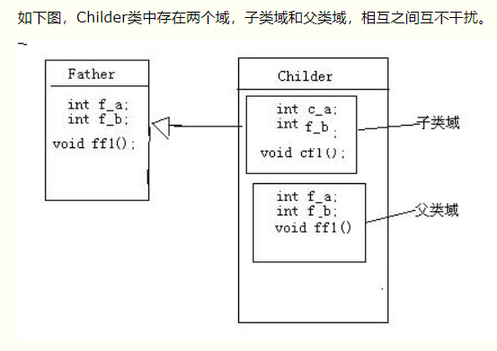
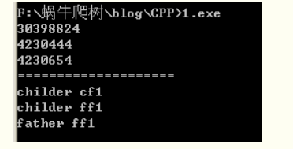
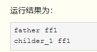

# C++

## 命名空间

作用为解决命名冲突。使用方式可以分域解析操作符`::`以及`using`声明（using declaration）

命名空间内部可以声明或定义变量，函数，typedef等。起作用的范围是“空间范围”，是在编译过程中完成的，该空间范围具体是指C++中的代码块，也就是指一对花括号之间的空间，如果C++是以单一源文件作为一个隔绝的编译单元，因此如果`using namespace xx;`不落在任何`{}`中，则以当前源文件结束，出自[白话C++](https://www.zhihu.com/question/333847992)。

## sizeof和strlen

strlen 是一个函数，它用来计算指定字符串 str 的长度，但**不包括结束字符**（即 null 字符）。

关键字 sizeof 是一个单目运算符，而不是一个函数。与函数 strlen 不同，它的参数可以是数组、指针、类型、对象、函数等，如下面的示例代码所示：

1. ```c++
   1. char sArr[] = "ILOVEC";
   2. /*用sizeof求长度*/
   3. printf("sArr的长度=%d\n", sizeof(sArr));
   ```

   

相对于函数 strlen，这里的示例代码运行结果为 7（因为它包括结束字符 null）。同时，对 sizeof 而言，因为缓冲区已经用已知字符串进行了初始化，其长度是固定的，所以 sizeof 在编译时计算缓冲区的长度。也正是由于在编译时计算，因此 sizeof 不能用来返回动态分配的内存空间的大小。char sArr[] = "ILOVEC";/*用sizeof求长度*/printf("sArr的长度=%d\n", sizeof(sArr));

## 继承： 子类与父类

构造方法不同于父类的其他函数，不能被子类继承。

子类在继承父类的时候，会先将父类的全部成员复制，然后标记是父类继承的，与子类本身的成员有所区别。



```C++
class Father
{
    int f_a;
    int f_b;
};

class Childer:public Father
{
    int c_a;
    int f_b;
};

int main()
{
    cout<<"sizeof childer:"<<sizeof(Childer)<<endl;   //-> 16，子类有4个成员变量，一共16个字节。
    cout<<"sizeof father:"<<sizeof(Father)<<endl;     //-> 8，父类有2个int变量，
}
```

### 隐藏： 子类对象优先考虑子类域自身成员（成员变量和成员函数）

子类有父类的同名成员时，编译器会优先考虑 **子类域** 中的自身成员，即使父类域中也有同名成员，也不会被检索到，因此，父类域中的同名成员被 **隐藏**， 即访问时完全以为该成员不存在，如果就想访问父类域中的该成员，则只能显式调用，即： `children.Father::m_m;`

```c++
class Father
{
public:
    int f_a;
    int f_b;
    void ff1() {cout<<"father ff1"<<endl;}
};

class Childer:public Father
{
public:
    int c_a;
    int f_b;
    void cf1() {cout<<"childer cf1"<<endl;}
    void ff1() {cout<<"childer ff1"<<endl;}
};

int main()
{
    Childer ch;

    cout<<ch.c_a<<endl; //只在子类域中的成员变量
    cout<<ch.f_b<<endl; //子类域和父类域都存在，优先访问子类域中的
    cout<<ch.Father::f_b<<endl; //显示访问被隐藏的成员变量

    cout<<"====================\n";

    ch.cf1();
    ch.ff1();
    ch.Father::ff1();
}
```



编译器在检索的时候，只根据名字，与函数的参数和返回类型无关。

```c++
int ff1(int a ){cout<<"children ff1"<<endl; return 0;}
```

此时主函数调用`ch.ff1()`会报错，原因是子类的`int ff1(int a)`会将父类的`void ff1()`隐藏，他们之间不存在重载，应该改为`ch.ff1(10)`才能够匹配到子类域中的该成员，或者想要调用父类中的`ff1()`，则显式的调用`ch.Father::ff1();`。

### 覆盖

覆盖的情况只发生在有**虚函数**的情况下，且 **父子类成员函数类型一模一样，参数和返回类型必须一致**，注意，不是隐藏，是覆盖了，隐藏的话父类的害在，而覆盖的意思是，子类的不存在了。

```c++
virtual void ff1(){cout<<"father ff1"<<endl;}
```

加上`virtual`后，运行结果不变。

- 虚函数的目的是为了 **在使用父类指针指向不同的子类对象时，调用虚函数调用的是对应子类对象的成员函数，也就是可以自动识别具体子类对象。** 因此，直接使用子类对象调用虚函数是没有意义的，一般情况下也不会这样使用。

  ```c++
  class Father
  {
  public:
      virtual void ff1() {cout<<"father ff1"<<endl;}
  };
  
  class Childer_1:public Father
  {
  public:
      void ff1() {cout<<"childer_1 ff1 "<<endl;}
  };
  
  
  class Childer_2:public Father
  {
  public:
      void ff1() {cout<<"childer_2 ff1"<<endl; }
  };
  
  int main()
  {
      Father* fp; // 声明一个父类指针
  
      Childer_1 ch1; //ch1是一个子类对象
      fp = &ch1; // 使用父类指针指向一个子类对象
      fp->ff1(); // 调用的是ch1对象的ff1()函数
  
      Childer_2 ch2;
      fp = &ch2;
      fp->ff1(); //调用的是ch2对象的ff1()函数
  
      // 仿佛父类的成员被覆盖了一样。这就是虚函数的魅力。
      return 0;
  }
  ```

  覆盖时，**子类虚函数必须与父类虚函数**有相同的参数列表，**否则认为是一个新的函数，与父类的该同名函数没有关系**。但不可以认为两个函数构成**重载**。

  ```c++
  class Father
  {
  public:
      virtual void ff1() {cout<<"father ff1"<<endl;}
  };
  
  class Childer_1:public Father
  {
  public:
      void ff1(int a) {cout<<"childer_1 ff1 "<<endl; }
  };
  
  int main()
  {
      Father* fp;
  
      Childer_1 ch1;
      fp = &ch1;
      fp->ff1();
     //ch1.ff1(); //没有匹配的成员
      ch1.ff1(2);
  
      return 0;
  }
  ```





## main函数

### 1. argc和argv

https://blog.csdn.net/dcrmg/article/details/51987413