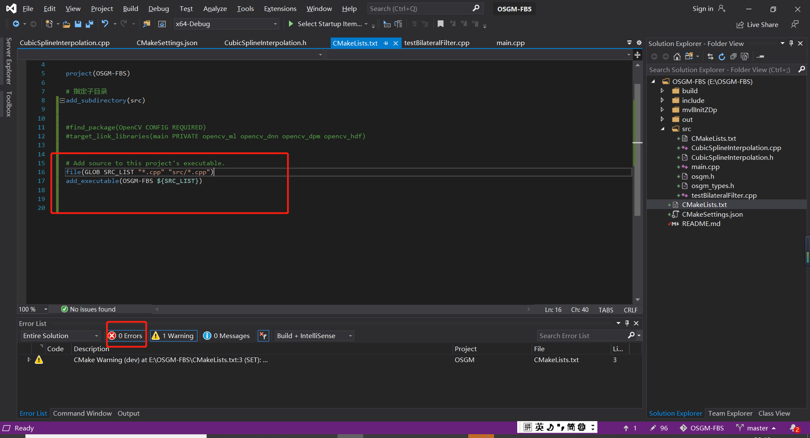

# cmake
## 1. 在vs中创建linux的cmake项目

https://docs.microsoft.com/en-us/cpp/linux/cmake-linux-project?view=vs-2019


## 2. cmake常用命令

参考学习资料：

1. https://www.cnblogs.com/hbccdf/p/introduction_of_cmake.html#%E4%BA%8C%E3%80%81cmake%E5%85%B8%E5%9E%8B%E7%A4%BA%E4%BE%8B
2. 


---


- 命令
- 变量
- 属性

### 设置编译目标类型

```cmake
add_exeutable(demo demo.cpp) #生成可执行文件
add_library(common util.cpp) #生成库文件，默认生成静态库，可以显式的控制生成的库的类型
add_library(common STATIC util.cpp) #生成静态库，在windows下是common.lib;linux下是libcommon.a
add_library(common SHARED util.cpp) #生成动态库或者共享库,在windows下是common.dll;linux下是libcommon.so
```

### 指定编译所包含的源文件

1. 明确**指定**包含的源文件

   ```cmake
   add_executable(demo demo.cpp test.cpp util.cpp)
   ```

2. 搜索所有的cpp文件

   ```cmake
   aux_source_directory(. SRC_LIST) #搜索当前目录下的所有.cpp文件
   add_executable(demo ${SRC_LIST})
   ```

3. 自定义搜索规则

   ```cmake
   file(GLOB SRC_LIST "*.cpp" "*.cc")
   add_executable(demo ${SRC_LIST})
   ```

4. 包含多个文件夹的文件（灵活，可行）

   

