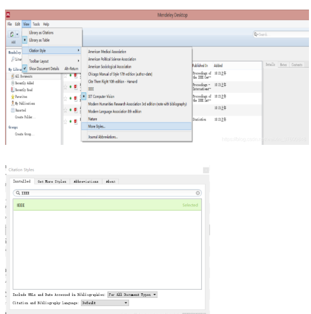
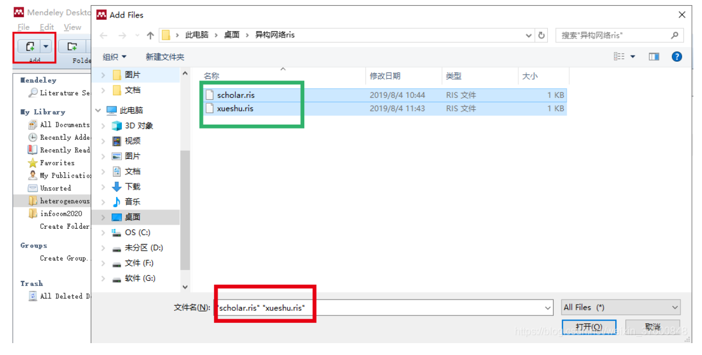
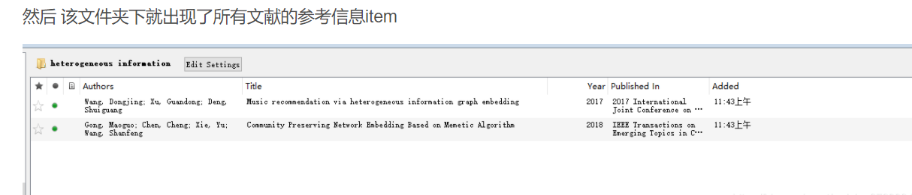
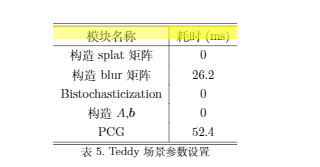

# 论文写作技巧及工具（如latex）

## mendeley + latex 一站式解决文献问题。

### 概述

使用mendeley管理文献。

首先在谷歌学术中导出refman格式的参考文献文件，然后在mendeley中add进来。

引用时再导出为bib格式，放入latex。

[参考链接](https://blog.csdn.net/weixin_37600848/article/details/98452062)

### 步骤

#### **1. 谷歌学术导出ref**


#### **2. mendeley设置导出参考文献格式。**

   

#### 3. mendeley添加ris






#### 4. 选中所有参考信息，右键导出bib，可放到latex中引用


## 参考

[零基础教程；简书](https://www.jianshu.com/p/3e842d67ada2)

## 图表

### 表格


```latex
\begin{table}[!htbp]
\centering
\begin{tabular}{c|c}
\hline\hline
模块名称 & 耗时(ms)\\
\hline
构造splat矩阵 & 0 \\
构造blur矩阵 & 26.2 \\
Bistochasticization & 0\\
构造$A$,$\boldsymbol{b}$ & 0\\
PCG & 52.4\\
\hline\hline
\end{tabular}
\caption{Teddy场景参数设置}
\label{tab:teddy_model_times}
\end{table}
```

