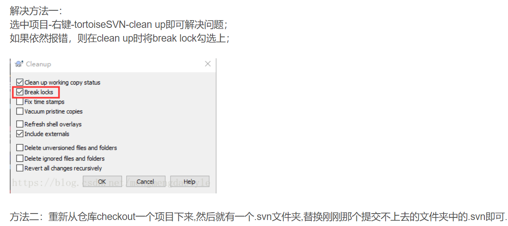

# SVN

## 参考

[TortoiseSVN使用教程](https://www.runoob.com/svn/tortoisesvn-intro.html)

## 报错及解决

1. Please execute the ‘Cleanup’ command
   [参考链接](https://blog.csdn.net/mengmengdastyle/article/details/80462925)

   